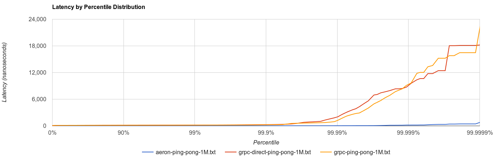

# Benchmark Results: 20 September 2016

### Introduction

[Google](https://google.com) and [Real Logic](http://real-logic.co.uk/) each
maintain open source binary serialization and network transport projects. The
purpose of this report is to explore the performance characteristics of these
stacks as applicable to Java Virtual Machine (JVM) only workloads.

The Google stack consists of
[Protocol Buffers](https://developers.google.com/protocol-buffers/) and
[gRPC](http://www.grpc.io/). The former's extensive range of programming
language integrations has led to it become something of a de facto standard for
high performance data interchange. gRPC continues this tradition by adding
polygot request-response, client-streaming, server-streaming and bi-directional
streaming support. While gRPC is serialization independent, it is most commonly
used with Protocol Buffers.

The Real Logic stack consists of
[Simple Binary Encoding](https://github.com/real-logic/simple-binary-encoding)
(SBE) and [Aeron](https://github.com/real-logic/Aeron). SBE emerged from work on
high performance trading applications and is therefore strongly focused on
statically-typed languages used in that space (ie C++ and Java). Aeron provides
an extremely efficient network transport for arbitrary binary buffers. The
buffers can contain any data, but for benchmarking purposes we will use SBE.

gRPC offers transport for both data center (server-to-server) workloads and
last mile (server-to-client) workloads. gRPC is well suited to this range of
purposes given its broad programming language support and
[layering](http://www.grpc.io/docs/guides/wire.html) on top of HTTP2. Aeron's
[design](https://github.com/real-logic/Aeron/wiki/Design-Overview) instead
focuses on data center workloads (server-to-server) and currently uses UDP for
all transfer operations.

Clearly gRPC and Aeron aim at different use cases and have made appropriate
engineering trade-offs to achieve their specific goals. Our own requirements
relate to market data transmission between JVM servers in the same data
center. As such Aeron would appear to more naturally align with our needs, but
we wanted to explore whether gRPC might be suitable given its rich capabilities
around last mile computing workloads and programming language interoperability.

### Benchmark Design

#### Ping-Pong

The ping-pong benchmark measures in nanoseconds the time it takes for a client
to send a request to the server and for the server's response to be received.
More specifically, a `long`-based message is sent to the server containing the
`System.nanoTime()`. The server then replies with the client-provided time. The
client then computes the time required by subtracting the delivered time from
the current `System.nanoTime()`. 1 million ping-pong round trips are measured.

#### Price Stream

The price stream benchmark measures in nanoseconds how long it takes for the
client to send a single request to the server and for the client to then
receive 100 million price messages. Each price message contains one `long` and
five `int` fields (ie 28 bytes), plus any framing and headers introduced by the
implementation under test. The `long` contains the `System.nanoTime()` of the
client request, allowing the client to compute the time required to receive each
of the 100 million price messages.

While 100 million price messages may seem excessive, it is only a small fraction
of the billions of price messages transmitted on a typical trading day.

#### Framing and Headers

Schemas were defined for Protocol Buffers and SBE to reflect the described
benchmarks. gRPC and Aeron were used in their default configurations as far as
practical. SBE allows users to completely define the message header schema.
While some optimisation of the SBE message header would have been feasible for
this benchmark, SBE's default eight byte message header was used.

#### gRPC Configuration

A default, Netty-based, plain-text gRPC client-server configuration was used.
Following a [suggestion](https://twitter.com/buchgr/status/778323926959128576),
`NettyServerBuilder.directExecutor()` was also benchmarked.

The price stream benchmark originally failed with
`io.netty.util.internal.OutOfDirectMemoryError: failed to allocate 16777216
byte(s) of direct memory (used: 28621930783, max: 28631367680)`. This was caused
because the server was making progress faster than the client and therefore gRPC
was allocating an ever-increasing buffer on the server. An interceptor was added
that used gRPC's `ServerCall.isReady()` method to busy spin while awaiting
buffer space.

#### Aeron Configuration

Aeron was operated with a dedicated media driver. SBE's message header was used
as the message identification mechanism, and the larger buffer (sized based on
the price stream benchmark) was always used, even for the ping-pong test.

In reality these simplifications increased Aeron transfer sizes. Smaller buffer
sizes could have been used for ping-pong, an initial handshake could agree on
message versions (and thus skip or at least reduce the message header size),
and distinct Aeron channel numbers could disambiguate messages (rather than
using SBE message headers to provide single channel multiplexing). All of these
changes would improve the Aeron results, at the cost of greater code complexity.

#### Machine Configuration

The server had 512 GB RAM and 2 x Intel Xeon E5-2667 v3 CPUs running with
hyper-threading disabled. Linux 4.7.2 and OpenJDK 1.8.0_102 were used. Library
versions were gRPC-Java 1.0.1, Aeron 1.0.1 and SBE 1.5.0.

All tests were executed against `localhost` without any rate limiting. The
kernel had been configured with `net.core.rmem_max=2097152` and
`net.core.wmem_max=2097152`. The machine ran no other workloads during the test.

### Benchmark Reproduction

To reproduce this benchmark, clone the repository and `mvn clean package`.
Uber JARs are available in each submodule's `target` directory.

The gRPC tests require the `au.com.acegi.rpcbench.grpc.BenchServer` is run
first. Then run `au.com.acegi.rpcbench.grpc.BenchClient`. The client will emit
`grpc-[benchmark]-[size].txt` files.

The Aeron tests require the `au.com.acegi.rpcbench.aeron.LowLatencyMediaDriver`
is started first. Then run `au.com.acegi.rpcbench.aeron.BenchServer`. Finally,
run `au.com.acegi.rpcbench.aeron.BenchClient`. The client will emit
`aeron-[benchmark]-[size].txt` files.

All graphs shown below were produced by uploading the generated text files to
[HdrHistogram Plots](http://hdrhistogram.github.io/HdrHistogram/plotFiles.html).

### Results

All values are in nanoseconds.

#### Ping-Pong

| Percentile | [gRPC Default](grpc-ping-pong-1M.txt) | [gRPC Direct Executor](grpc-direct-ping-pong-1M.txt) | [Aeron](aeron-ping-pong-1M.txt) |
| ---------- | ----: | -----: | --: |
| 0.00       | 69    | 59     | 3   |
| 0.10       | 93    | 99     | 4   |
| 0.20       | 99    | 105    | 5   |
| 0.30       | 103   | 111    | 5   |
| 0.40       | 107   | 115    | 6   |
| 0.50       | 111   | 120    | 6   |
| 0.60       | 116   | 124    | 6   |
| 0.70       | 121   | 129    | 6   |
| 0.80       | 127   | 136    | 6   |
| 0.90       | 136   | 146    | 7   |
| 0.95       | 145   | 156    | 8   |
| 0.99       | 163   | 183    | 10  |
| 0.999      | 577   | 286    | 17  |
| 1.00       | 23,707| 18,235 | 879 |

Aeron's latency is far lower, and much more stable.

#### Price Stream

| Percentile | [gRPC Default](grpc-price-stream-100M.txt) | [Aeron](aeron-price-stream-100M.txt) |
| ---------- | ------------: | ---------: |
| 0.00       | 1,107         | 25         |
| 0.10       | 112,810,000   | 692,060    |
| 0.20       | 221,459,251   | 1,299,185  |
| 0.30       | 332,859,965   | 1,880,096  |
| 0.40       | 445,871,292   | 2,480,930  |
| 0.50       | 554,587,652   | 3,061,841  |
| 0.60       | 668,404,285   | 3,674,210  |
| 0.70       | 782,757,789   | 4,265,607  |
| 0.80       | 897,111,293   | 4,861,198  |
| 0.90       | 1,010,927,927 | 5,460,983  |
| 0.95       | 1,066,762,502 | 5,758,779  |
| 0.99       | 1,117,765,238 | 5,989,466  |
| 0.999      | 1,120,986,464 | 6,039,797  |
| 1.00       | 1,122,060,206 | 6,043,992  |

The gRPC direct executor was cancelled after 2.5 hours without completing.

Aeron completed the transfer 185 times faster than gRPC. Aeron transferred the
100 million price messages in 6 seconds, as opposed to gRPC requiring 19
minutes. In terms of approximate messages per second, Aeron delivered 17 million
per second against gRPC delivering close to 89,000 per second. Aeron's usable
throughput was therefore around 445 MB per second (for the 28 byte SBE message),
or 572 MB including the user-customisable 8 byte SBE message header.

### Conclusion

As noted in the introduction, Aeron and gRPC aim at different workloads and use
different underlying transport protocols. They also offer different usability
experiences, with gRPC providing an easier initial learning curve and broader
turnkey capabilities. While Aeron is not difficult to use, users must make many
decisions that gRPC abstracts away.

gRPC and Aeron also differ significantly at the low-level implementation level.
For example, Aeron recommends (though does not require) a dedicated media driver
process and busy spin strategies, whereas gRPC always embeds the transport in
the client and server processes.

Both gRPC and Aeron provide many tuning options that could improve their
respective results. Pull requests are welcome.

If you are interested in other low latency benchmarks on the JVM, you might like
to browse our
[Embedded Key-Value Store Benchmark](https://github.com/lmdbjava/benchmarks)
and
[JVM Hashing Algorithm Benchmark](https://github.com/benalexau/hash-bench)
reports.
